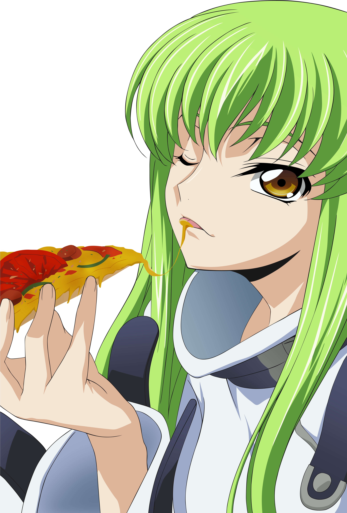

<table style="margin: 0; padding: 0; border-spacing: 0;">
<tr style="margin: 0; padding: 0;">
<td valign="top" align="center" style="padding: 0; margin: 0;">

<h1>@SAP2B</h1>
<h3>Hardware & Systems Architect</h3>
<h4>Bit Twiddler & Logic Designer</h4>
<h5>Optimizing Clock Cycles</h5>
<h6>Down to the metal</h6>

 
 
 
 
 
 
 
 
 
 
 
 

</td>

<td width="500" valign="top">

<pre>

<h2>SAP2B/
├── 📁 x86/
│   └── 📁 64/
│       ├── 🧙 fasm.macro
│       ├── 🧪 2b.test
│       ├── 👾 demoscener.asm
│       ├── 👾 cordic.asm
│       ├── 👾 gameboy.asm
│       ├── 👾 darpa.asm
│       ├── 👾 forth.asm
│       ├── 👾 nasa_apollo.asm
│       ├── 👾 hft.asm
│       ├── 💀 bloat_reaper.asm
│       ├── 🚫 no_heap_zone.asm
│       ├── 👻 ghost_protocol.asm
│       └── 🔐 pqc.asm
├── 📁 riscv/
│   └── 🧙 gas.macro
├── 📁 arm/
│   └── 🧙 gas.macro
├── 📁 asic/
│   ├── 🧙 verilog.v
│   └── 🧙 fpga.v
├── 📁 music/
│   ├── 🎸 rock
│   ├── 🤘 metal
│   ├── ⚡ electronic
│   ├── 🎙️ rap
│   ├── 🎻 classical
│   ├── 🌌 ambient
│   └── ⚙️ industrial
├── 📁 languages/
│   ├── 🇯🇵 japanese
│   ├── 🇧🇷 portuguese
│   └── 🇺🇸 english
└── 📁 anime/
    ├── ♟️ code_geass
    ├── 📓 death_note
    ├── 👹 monster
    ├── ⚔️ sword_art_online
    ├── 👑 overlord
    ├── 🦠 parasyte
    ├── ⚖️ psycho_pass
    ├── 🤖 ghost_in_the_shell
    ├── 🛡️ vinland_saga
    ├── 🗡️ berserk
    └── 🎣 hunter_x_hunter
</pre>
<h2>

</td>

</tr>
</table>
